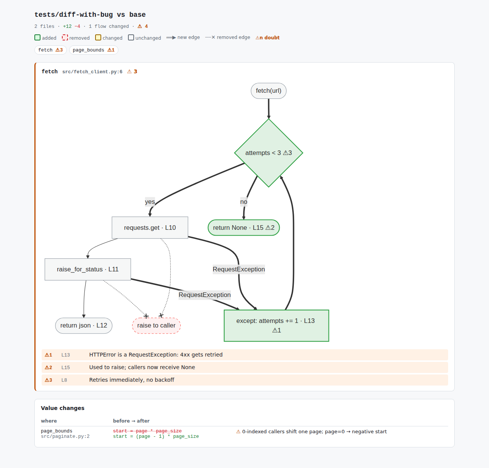

# reviewing-ai-diffs

A Claude Code skill that turns an AI-generated diff into control-flow
pictures, not more text to read.

You can already see the diff in git. What's hard to see is how the *paths*
through the code changed: a new retry loop, an error that used to propagate
and is now swallowed, a caller that can suddenly get `None`. This skill
draws each changed function as one merged before/after flowchart
(added = green, removed = dashed red, changed = amber), pins independently
found doubts to the nodes that cause them, and keeps prose to a minimum.



## Install

```
claude plugin marketplace add snehalvartak/reviewing-ai-diffs
```

## Use

Ask Claude to review a diff, or invoke the skill directly:

```
/reviewing-ai-diffs
```

- Default: working tree vs `HEAD` (staged + unstaged).
- `/reviewing-ai-diffs branch` — current branch vs its base.
- `/reviewing-ai-diffs <commit-range>` — a custom range.

Output is a single page:

- **Flow** — a delta flowchart per function whose branches, loops,
  returns, raises, or calls changed. Every node carries its line number.
- **Calls** — changed functions and their callers, with broken contracts
  marked on the edge.
- **Value changes** — one `old → new` row per function whose flow is the
  same but an expression, constant, or signature changed.
- **No flow change** — one line per remaining file.
- **⚠ doubts** — from a subagent that sees only before/after source and
  call sites (not the intent), ≤3 per function, ≤10 words each.

Chat gets the link and one count line. See
[`tests/diff-with-bug/example-report.html`](tests/diff-with-bug/example-report.html)
for the output on the test fixture.

See [`skills/reviewing-ai-diffs/SKILL.md`](skills/reviewing-ai-diffs/SKILL.md)
for the full process, and
[`docs/2026-08-09-guided-review-design.md`](docs/2026-08-09-guided-review-design.md)
for the design rationale.

## Contributing

Bug reports, feature requests, and pull requests are welcome — see
[`CONTRIBUTING.md`](CONTRIBUTING.md) for how to report issues and submit
changes.
