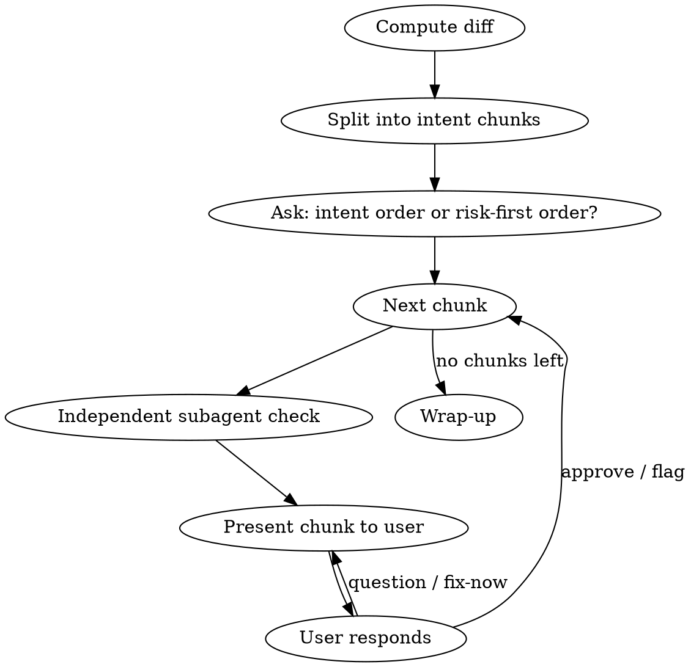

# Guided Review

## Overview

AI-written code lacks the "why" a human author carries in their head, and
large diffs compound that into overload. This skill walks a diff one
logical chunk at a time, each pre-screened by an independent subagent
before you see it, so you never face the whole diff at once and get a
second opinion on top of your own.

## When to Use

- Reviewing a diff (working tree, branch, or commit range) that an AI
  assistant produced, before committing/merging it.
- The diff spans multiple files or concerns, or you don't have full context
  on why each part was written.

Not for: style/over-engineering review (use `ponytail-review`), or spec-vs-
standards review of a finished PR (use `code-review`). This skill is about
comprehension and catching plausible-but-wrong code under review fatigue.

## Scope

Default: diff of working tree against `HEAD` (`git diff HEAD`) — staged and
unstaged combined.

- `reviewing-ai-diffs branch` — diff current branch against its base (e.g. `main`).
- `reviewing-ai-diffs <commit-range or description>` — user-specified scope.

If the diff is empty, say so and stop. Don't proceed to chunking.

## The Loop



### 1. Split the diff into intent chunks

One chunk = one coherent piece of work (e.g. "added retry logic to the
fetch client"), even if it spans multiple files. Never chunk by file — that
reintroduces the overload the skill exists to prevent.

Intent source, in priority order:
1. A plan/spec doc for the work, a linked issue, or recent commit messages
   — use as ground truth for what each chunk is for.
2. Otherwise, infer intent from the diff itself, and state the inferred
   intent explicitly in the chunk (see template below) so the user can
   correct it if it's wrong.

Tag each chunk with a risk category, e.g. `core-logic` / `data-mutation` /
`auth` (high) vs. `boilerplate` / `formatting` / `tests` (low) — these are
illustrative, not an exhaustive list; use whatever label fits the change.
Compute the risk tag independent of which ordering the user picks next, so
the tag isn't biased by the order chosen.

Ask the user once, before the first chunk: review in **intent order**
(default — mirrors how a human would narrate a PR) or **risk-first**
(riskiest chunk first)? This is a real question requiring a real answer —
wait for it before presenting chunk 1, even if the user is in a hurry.
Noting the default and moving on without waiting is the same mistake as
skipping the question outright. Don't re-ask per chunk.

### 2. Independent check, before showing the user anything

For each chunk, dispatch a subagent with **only the chunk's diff and
surrounding code** — not the conversation history, not the stated intent,
not why it was written. Ask it to actively try to break the chunk: edge
cases, error/null handling, off-by-one, and specifically whether the code's
actual behavior matches what its stated intent claims. It must return either
concrete doubts or an explicit "no issues found" — never a rubber stamp.

This independence is the point: a subagent with no stake in the code being
right, and no exposure to the narrative that justified it, catches what a
same-context re-read misses.

### 3. Present the chunk

Use this template for every chunk — consistent shape keeps each one fast to
scan regardless of how deep into the diff you are:

```markdown
## Chunk N: <short name> — risk: <risk tag>

**What changed:** <2-4 bullets, concise, not a raw diff dump>

**Why:** <the intent — from the plan/commits, or "(inferred)" if guessed>

**Worth checking:** <subagent's doubts, phrased as questions to verify, not
as confirmed bugs — or "Independent check found nothing." if clean>

<short inline code excerpt only if it helps, not the full diff>
```

### 4. Take the user's response

One of:
- **Approve** → move to next chunk.
- **Ask a question** → answer using the actual code, re-present the chunk.
- **Flag a concern** → record it, then move to next chunk (or fix now).
- **Fix now** → edit the code, re-run the independent check (step 2) on the
  new version, then re-present before moving on.

Advance only on an explicit approve or flag-and-move-on — never auto-advance.

### 5. Wrap up

After the last chunk, summarize:
- Chunks approved as-is.
- Chunks flagged, with the user's note.
- Subagent doubts raised but never resolved.

Offer to fix any flagged/unresolved items immediately. Then offer — once,
not per-chunk — to publish the summary as an HTML Artifact if the user wants
a persistent record; otherwise the markdown summary in chat is the whole
deliverable.

## Common Mistakes

| Mistake | Fix |
|---|---|
| Chunking by file instead of by intent | Group by what changed *together for a reason*, even across files |
| Skipping the independent subagent check to save time | It's the step that catches plausible-but-wrong code; the walkthrough's value collapses without it |
| Presenting all chunks in one message | One chunk, one message, wait for the user's response before the next |
| Subagent's doubts stated as confirmed bugs | Frame as "worth checking" — the subagent can be wrong too |
| Asking the ordering question but not waiting for an answer (e.g. defaulting and mentioning the alternative as an aside) because the user seems rushed, or re-asking it every chunk | Ask once, at the start, and wait — "in a hurry" is exactly the pressure this skill is designed to hold up under |
